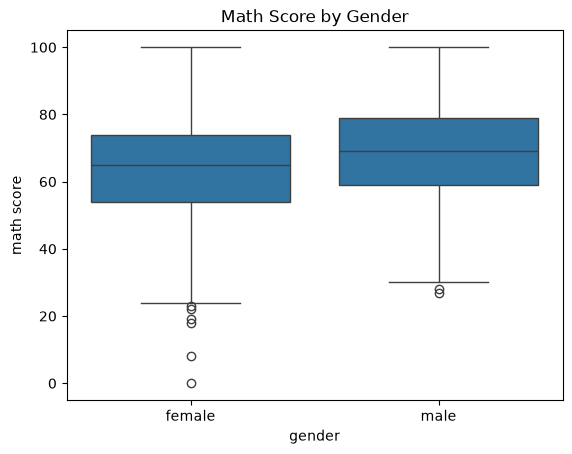
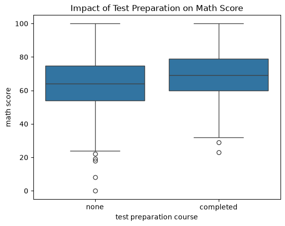
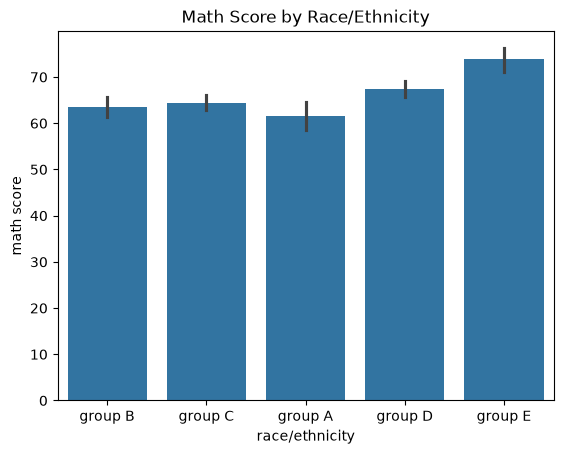
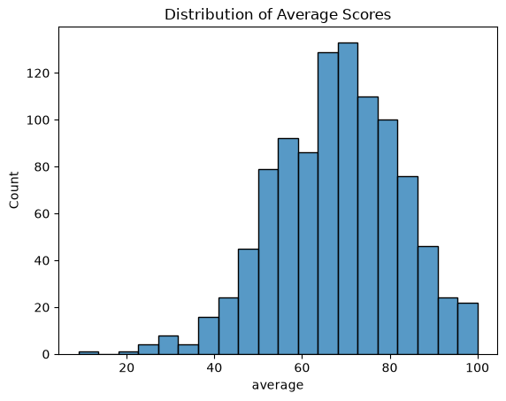
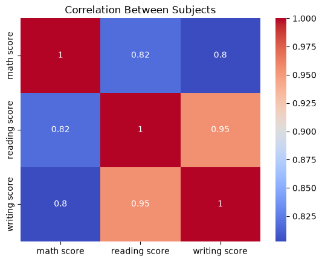

# Students Performance Analysis 📊

## Overview
An exploratory data analysis (EDA) project analyzing the performance of 1000 students 
across math, reading, and writing exams using Python.

## Questions Answered
1. What is the average score in each subject?
2. Do males or females perform better?
3. Does test preparation improve scores?
4. Which race/ethnicity group performs best overall?
5. Who are the top 10 students overall?

## Key Findings
- Males score higher in math; females score higher in reading and writing
- Students who completed test preparation scored noticeably higher across all subjects
- Group E has the highest average math score; Group A has the lowest
- All three subjects are strongly correlated (0.80+)
- Most students average between 60-75 across all subjects

## Visualizations

### Math Score by Gender

### Test Preparation Impact

### Math Score by Race/Ethnicity

### Average Score Distribution

### Correlation Heatmap

## Tools Used
- Python
- Pandas — data manipulation and analysis
- Matplotlib — data visualization
- Seaborn — statistical visualizations

## Dataset
[Students Performance in Exams](https://www.kaggle.com/datasets/spscientist/students-performance-in-exams) — Kaggle

## How to Run
1. Clone the repo
2. Install dependencies: `pip install pandas matplotlib seaborn`
3. Run: `python analysis.py`
